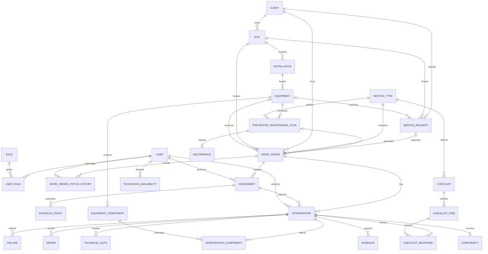

# Modulos y esquema central de entidades

## 1. Criterios de modelado

Este documento deriva el modelo exclusivamente de [project-description.md](project-description.md), la fuente funcional de verdad de FieldFlow.

El eje de trazabilidad es:

**Client -> Site -> Installation -> Equipment -> Service Request -> Work Order -> Assignment -> Schedule -> Intervention -> Evidence/Conformity -> Maintenance History**

Las entidades representan informacion persistente. Los valores del ciclo de vida son controlados, y los registros con historial deben desactivarse en lugar de eliminarse fisicamente. Las fechas de negocio usan `timestamptz` en PostgreSQL.

## 2. Modulos principales

| Modulo | Responsabilidad | Entidades principales |
|---|---|---|
| Identity and Access | Identificar a los usuarios de la plataforma y controlar los permisos | `user`, `role`, `user_role` |
| Clients and Assets | Mantener el contexto fisico y operativo del servicio | `client`, `site`, `installation`, `equipment` |
| Service Requests and Work Orders | Recibir necesidades, definir el trabajo y controlar su ciclo de vida | `service_request`, `work_order`, `service_type`, `work_order_status_history` |
| Planning and Scheduling | Gestionar la disponibilidad de tecnicos, las asignaciones y la agenda | `technician_availability`, `assignment`, `schedule_event` |
| Field Execution | Registrar lo ocurrido durante una intervencion | `intervention`, `failure`, `repair`, `equipment_component`, `intervention_component`, `checklist`, `checklist_item`, `checklist_response`, `technical_note` |
| Evidence and Conformity | Respaldar el trabajo realizado y obtener la aceptacion del cliente | `evidence`, `conformity` |
| Preventive Maintenance | Programar mantenimientos recurrentes y generar trabajos futuros | `preventive_maintenance_plan`, `recurrence` |

## 3. Roles

Los roles de negocio minimos son:

- `ADMINISTRATION`: recibe solicitudes, administra clientes y activos, crea work orders, planifica, asigna y supervisa la operacion.
- `TECHNICIAN`: consulta los trabajos asignados, los ejecuta y registra interventions, checklists, technical notes, evidence y conformity.

`user_role` permite que una persona tenga varios roles sin acoplar el modelo a una unica combinacion de permisos. Los permisos pertenecen a la capa de autorizacion y no deben duplicarse como columnas en las entidades operativas.

## 4. Entidades por modulo

### 4.1 Identity and Access

#### `user`

Persona interna que utiliza FieldFlow.

- `id` UUID, PK.
- `name`.
- `email`, unico.
- `password_hash`.
- `active`.
- `created_at`, `updated_at`.

#### `role`

Catalogo de roles de negocio.

- `id` UUID, PK.
- `code`, unico: `ADMINISTRATION` o `TECHNICIAN`.
- `name`.

#### `user_role`

Relacion muchos a muchos entre usuarios y roles.

- `user_id` UUID, FK a `user`.
- `role_id` UUID, FK a `role`.
- PK compuesta (`user_id`, `role_id`).

Un usuario con el rol `TECHNICIAN` puede recibir trabajos. Una entidad `technician` separada es innecesaria mientras no aparezcan atributos propios del tecnico.

### 4.2 Clients and Assets

#### `client`

Organizacion que solicita o recibe servicios.

- `id` UUID, PK.
- `legal_name`.
- `tax_identifier`, unico cuando exista.
- `active`.
- `created_at`, `updated_at`.

#### `site`

Ubicacion perteneciente a un cliente.

- `id` UUID, PK.
- `client_id` UUID, FK a `client`, obligatorio.
- `name`.
- `address` y datos de ubicacion.
- `operational_contact`.
- `active`.

#### `installation`

Sububicacion o instalacion dentro de un site.

- `id` UUID, PK.
- `site_id` UUID, FK a `site`, obligatorio.
- `name`.
- `description`.
- `active`.

#### `equipment`

Activo que recibe mantenimiento.

- `id` UUID, PK.
- `installation_id` UUID, FK a `installation`, obligatorio.
- `asset_identifier` o numero de serie, unico dentro del alcance definido.
- `name` o tipo de equipo.
- `brand`, `model`.
- `current_status`.
- `active`.
- `created_at`, `updated_at`.

Relaciones:

- Un `client` tiene muchos `site`; cada `site` pertenece a un `client`.
- Un `site` tiene muchas `installation`; cada `installation` pertenece a un `site`.
- Una `installation` tiene muchos `equipment`; cada `equipment` pertenece a una `installation`.
- El `work_order` debe conservar el snapshot de la ubicacion del servicio, porque el equipo puede cambiar de ubicacion posteriormente.

### 4.3 Service Requests and Work Orders

#### `service_request`

Registro administrativo de una necesidad de mantenimiento.

- `id` UUID, PK.
- `client_id` UUID, FK a `client`.
- `site_id` UUID, FK a `site`.
- `equipment_id` UUID, FK a `equipment`, nullable cuando el activo aun no esta identificado.
- `description`.
- `received_at`.
- `status`: `RECEIVED`, `CONVERTED`, `CANCELLED`.
- `created_at`.

#### `service_type`

Catalogo que clasifica el trabajo requerido.

- `id` UUID, PK.
- `name`, unico.
- `description`.
- `active`.

#### `work_order`

Unidad central de planificacion, ejecucion y trazabilidad.

- `id` UUID, PK.
- `number`, unico y legible.
- `service_request_id` UUID, FK a `service_request`, nullable para mantenimiento preventivo.
- `preventive_maintenance_plan_id` UUID, FK a `preventive_maintenance_plan`, nullable para trabajos originados por solicitudes.
- `client_id` UUID, FK a `client`.
- `site_id` UUID, FK a `site`.
- `installation_id` UUID, FK a `installation`, nullable.
- `equipment_id` UUID, FK a `equipment`, nullable.
- `site_name_snapshot`, `site_address_snapshot`.
- `installation_name_snapshot`, nullable.
- `equipment_identifier_snapshot`, nullable.
- `service_type_id` UUID, FK a `service_type`.
- `title`.
- `instructions`.
- `priority`.
- `estimated_duration_minutes`.
- `due_at`.
- `status`.
- `created_at`, `updated_at`.

Estados minimos de `work_order` para v1: `PENDING`, `ASSIGNED`, `EN_ROUTE`, `IN_PROGRESS`, `PENDING_CUSTOMER_CONFIRMATION`, `COMPLETED` y `RESCHEDULED`. `CANCELLED` no forma parte de la version v1.

#### `work_order_status_history`

Historial inmutable de los cambios de estado de un `work_order`. Esta entidad es necesaria para reconstruir lo ocurrido a lo largo del tiempo.

- `id` UUID, PK.
- `work_order_id` UUID, FK a `work_order`.
- `from_status`, nullable para el estado inicial.
- `to_status`.
- `changed_by_user_id` UUID, FK a `user`.
- `changed_at`.
- `reason`, nullable.

Relaciones:

- Un `service_request` puede originar cero o un `work_order`.
- Un `work_order` pertenece a un `client`, un `site` y un `service_type`, y puede referenciar opcionalmente una `installation` y un `equipment`.
- Un `preventive_maintenance_plan` puede generar muchos `work_order`.
- Un `work_order` tiene muchos registros de `work_order_status_history`; `work_order.status` es la proyeccion del estado actual.

### 4.4 Planning and Scheduling

#### `technician_availability`

Intervalo en el que un tecnico puede recibir una asignacion.

- `id` UUID, PK.
- `technician_id` UUID, FK a `user` con el rol `TECHNICIAN`.
- `starts_at`, `ends_at` (`timestamptz`).
- `status`.
- `notes`.

#### `assignment`

Historial de asignacion de un `work_order` a un tecnico.

- `id` UUID, PK.
- `work_order_id` UUID, FK a `work_order`.
- `technician_id` UUID, FK a `user`.
- `assigned_by_user_id` UUID, FK a `user`.
- `planned_start_at`, `planned_end_at`.
- `status`: `ACTIVE`, `REPLACED`, `CANCELLED`, `COMPLETED`.
- `rescheduling_reason`.
- `created_at`.

#### `schedule_event`

Bloque visible en la agenda vinculado a una asignacion.

- `id` UUID, PK.
- `assignment_id` UUID, FK a `assignment`.
- `starts_at`, `ends_at`.
- `status`.
- `created_at`, `updated_at`.

Relaciones:

- Un tecnico tiene muchos intervalos de `technician_availability`.
- Un `work_order` puede tener muchas `assignment` historicas, con como maximo una asignacion activa segun las reglas de negocio.
- Una `assignment` puede tener muchos `schedule_event` cuando se deben conservar las reprogramaciones.

### 4.5 Field Execution

#### `intervention`

Registro de la ejecucion real de un `work_order`.

- `id` UUID, PK.
- `work_order_id` UUID, FK a `work_order`.
- `assignment_id` UUID, FK a `assignment`.
- `technician_id` UUID, FK a `user`.
- `actual_started_at`, `actual_ended_at`.
- `result`.
- `observations`.
- `created_at`, `updated_at`.

Se permiten varias `intervention` por `work_order`, porque un servicio puede requerir varias visitas. Cada intervencion pertenece a la `assignment` utilizada para esa visita.

#### `failure`

Falla detectada o reportada durante una `intervention`.

- `id` UUID, PK.
- `intervention_id` UUID, FK a `intervention`.
- `description`.
- `severity`.
- `detected_at`.
- `resolved`.

#### `repair`

Reparacion realizada o requerida durante una `intervention`.

- `id` UUID, PK.
- `intervention_id` UUID, FK a `intervention`.
- `description`.
- `status`: `REQUIRED`, `IN_PROGRESS`, `COMPLETED`, `DEFERRED`.
- `completed_at`, nullable.
- `notes`, nullable.

#### `equipment_component`

Componente identificable que pertenece a un `equipment`.

- `id` UUID, PK.
- `equipment_id` UUID, FK a `equipment`.
- `name`.
- `part_number`, nullable.
- `serial_number`, nullable.
- `current_status`.
- `active`.

#### `intervention_component`

Relaciona los componentes intervenidos con una `intervention` y describe la accion realizada sobre cada uno.

- `id` UUID, PK.
- `intervention_id` UUID, FK a `intervention`.
- `equipment_component_id` UUID, FK a `equipment_component`.
- `action`: `INSPECTED`, `REPAIRED`, `REPLACED`, `INSTALLED`, `REMOVED`, `ADJUSTED`.
- `description`.
- `created_at`.

Relaciones:

- Una `intervention` puede registrar muchas `failure` y muchas `repair`.
- Un `equipment` puede tener muchos `equipment_component`.
- Una `intervention` puede intervenir muchos componentes y cada componente puede aparecer en muchas intervenciones mediante `intervention_component`.
- La regla de negocio debe validar que el `equipment_component` intervenido pertenezca al `equipment` del `work_order` asociado.

#### `checklist`

Plantilla versionada de verificaciones aplicable a un `service_type`.

- `id` UUID, PK.
- `service_type_id` UUID, FK a `service_type`.
- `name`.
- `version`.
- `active`.

#### `checklist_item`

Verificacion individual definida por un `checklist`.

- `id` UUID, PK.
- `checklist_id` UUID, FK a `checklist`.
- `position`.
- `label`.
- `response_type`.
- `required`.

#### `checklist_response`

Respuesta a un `checklist_item` durante una `intervention`.

- `id` UUID, PK.
- `intervention_id` UUID, FK a `intervention`.
- `checklist_item_id` UUID, FK a `checklist_item`.
- `value`.
- `observation`.
- `answered_at`.

La version del `checklist` y las definiciones de sus items utilizadas deben permanecer inmutables una vez aplicadas a una `intervention`.

#### `technical_note`

Nota registrada durante una `intervention`.

- `id` UUID, PK.
- `intervention_id` UUID, FK a `intervention`.
- `author_user_id` UUID, FK a `user`.
- `content`.
- `created_at`.

### 4.6 Evidence and Conformity

#### `evidence`

Archivo o registro que respalda el trabajo realizado.

- `id` UUID, PK.
- `intervention_id` UUID, FK a `intervention`.
- `type`: `PHOTO`, `MEASUREMENT`, `DOCUMENT` u `OTHER`.
- `file_name`.
- `storage_location`.
- `mime_type`, `size_bytes`.
- `description`.
- `captured_at`.
- `created_at`.

PostgreSQL debe almacenar los metadatos, mientras que el binario debe permanecer en un almacenamiento de objetos, salvo que una decision de arquitectura posterior indique lo contrario.

#### `conformity`

Aceptacion o firma del cliente sobre una `intervention`.

- `id` UUID, PK.
- `intervention_id` UUID, FK a `intervention`, unico.
- `signer_name`.
- `customer_role`.
- `signer_identifier`, nullable.
- `signature` o referencia al archivo de firma.
- `accepted_at`.
- `observations`.

Relaciones:

- Una `intervention` pertenece a un `work_order`, una `assignment` y un `technician`.
- Una `intervention` tiene muchas `checklist_response`, `technical_note` y `evidence`.
- Una `intervention` puede tener cero o una `conformity`.
- El `work_order` pasa a `PENDING_CUSTOMER_CONFIRMATION` hasta que la regla de negocio permita completarlo.

### 4.7 Preventive Maintenance

#### `preventive_maintenance_plan`

Definicion del mantenimiento preventivo planificado para un activo `equipment`.

- `id` UUID, PK.
- `equipment_id` UUID, FK a `equipment`.
- `service_type_id` UUID, FK a `service_type`.
- `name`.
- `description`.
- `starts_on`.
- `next_execution_at`.
- `active`.
- `created_at`, `updated_at`.

#### `recurrence`

Regla de repeticion asociada a un `preventive_maintenance_plan`.

- `id` UUID, PK.
- `preventive_maintenance_plan_id` UUID, FK a `preventive_maintenance_plan`, unico.
- `frequency`.
- `interval`.
- `day_of_month` o `day_of_week`, segun la frecuencia.
- `ends_on`, nullable.

Cada ejecucion preventiva genera un `work_order` y sigue el mismo flujo de `assignment`, `schedule_event`, `intervention`, `evidence`, `conformity` e historial que cualquier otro servicio.

## 5. Maintenance history

`maintenance_history` debe ser una consulta o una vista materializada, no una tabla fuente duplicada. Se deriva de las `intervention` completadas, los `work_order`, `equipment`, `failure`, `repair`, `equipment_component`, `intervention_component`, `technical_note`, `evidence`, `checklist_response` y `conformity`.

Ruta conceptual de consulta:

`equipment -> work_order -> intervention -> (failure, repair, intervention_component, checklist_response, technical_note, evidence, conformity)`

## 6. Diagrama relacional conceptual

## 7. Reglas relacionales para PostgreSQL

- Usar claves primarias y foraneas UUID, con `NOT NULL` en toda relacion obligatoria.
- Usar `timestamptz` para agenda, disponibilidad, recepcion y ejecucion.
- Usar restricciones `CHECK` o tablas de catalogo para estados, prioridades, tipos de respuesta y frecuencias.
- Agregar indices a todas las claves foraneas y a `work_order (status, priority, due_at)`, `assignment (technician_id, planned_start_at)`, `equipment (installation_id)` y `intervention_component (equipment_component_id)`.
- Aplicar unicidad a `email`, `work_order.number` y los identificadores naturales definidos.
- Evitar la eliminacion fisica de `client`, `equipment`, `work_order`, `intervention` y `evidence` con historial; usar `active` o estados del ciclo de vida.
- Validar que un `equipment` pertenezca al `site` del `work_order` y que un usuario asignado tenga el rol `TECHNICIAN`.
- Registrar `created_at` y `updated_at` en entidades modificables y mantener `work_order_status_history` como historial de solo insercion.
