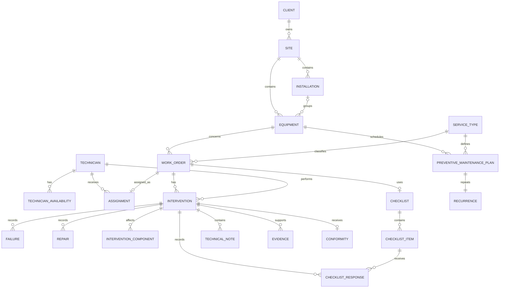

# Módulos y esquema central de entidades — MVP

## 1. Fuente de verdad y criterio de alcance

Este documento deriva el modelo funcional exclusivamente de `project-description.md`, que actúa como fuente única y absoluta de verdad para FieldFlow.

El modelo se diseña para un MVP con una duración total de 5 semanas, por lo que el alcance debe protegerse de complejidades que no sean necesarias para cumplir el criterio de éxito del proyecto.

El flujo funcional principal del MVP es:

**Cliente -> Sede -> Equipo -> Orden de Trabajo -> Asignación -> Agenda -> Intervención -> Evidencia -> Conformidad -> Historial**

`installation` se mantiene como nivel opcional de organización física dentro de una sede, porque la descripción del proyecto menciona sedes, instalaciones y equipos, pero no establece que todo equipo deba pertenecer obligatoriamente a una instalación.

El criterio de éxito que guía este modelo es que, a partir de una Orden de Trabajo, se pueda conocer:

- el cliente;
- la ubicación;
- el equipo involucrado;
- el técnico asignado;
- el estado del servicio;
- lo realizado durante la intervención;
- el checklist;
- las fotografías y demás evidencia;
- las notas técnicas;
- la conformidad del cliente;
- el historial de mantenimiento del equipo.

Las decisiones puramente técnicas de persistencia, auditoría, seguridad, almacenamiento de archivos, índices, tipos SQL, UUID, soft-delete o timestamps globales no forman parte de este documento salvo que sean necesarias para expresar una relación funcional.

---

## 2. Módulos principales del MVP

| Módulo | Responsabilidad | Entidades principales |
|---|---|---|
| Clients and Assets | Mantener clientes, sedes, instalaciones opcionales y equipos | `client`, `site`, `installation`, `equipment` |
| Work Orders | Definir y seguir el trabajo a realizar | `work_order`, `service_type` |
| Planning and Scheduling | Gestionar técnicos, disponibilidad, asignaciones y agenda | `technician`, `technician_availability`, `assignment` |
| Field Execution | Registrar lo ocurrido durante el trabajo de campo | `intervention`, `failure`, `repair`, `intervention_component`, `checklist`, `checklist_item`, `checklist_response`, `technical_note` |
| Evidence and Conformity | Respaldar el trabajo realizado y registrar la conformidad del cliente | `evidence`, `conformity` |
| Preventive Maintenance | Programar mantenimientos recurrentes sobre equipos | `preventive_maintenance_plan`, `recurrence` |

---

## 3. Entidades por módulo

### 3.1 Clients and Assets

#### `client`

Organización que solicita o recibe servicios técnicos.

Campos funcionales mínimos:

- `id` — identificador técnico.
- `name` — nombre del cliente.

Relaciones:

- Un `client` tiene una o muchas `site`.
- Las Órdenes de Trabajo de un cliente se obtienen a través de sus sedes y equipos.

---

#### `site`

Sede o ubicación principal perteneciente a un cliente.

Campos funcionales mínimos:

- `id` — identificador técnico.
- `client_id` — referencia al `client`.
- `name` — nombre de la sede.
- `address` — ubicación donde se presta el servicio.

Relaciones:

- Una `site` pertenece a un `client`.
- Una `site` puede contener varias `installation`.
- Una `site` puede contener varios `equipment`.

---

#### `installation`

Sububicación opcional dentro de una sede.

Campos funcionales mínimos:

- `id` — identificador técnico.
- `site_id` — referencia a la `site`.
- `name` — identificación de la instalación.

Relaciones:

- Una `installation` pertenece a una `site`.
- Una `installation` puede contener varios `equipment`.
- Un `equipment` puede pertenecer opcionalmente a una `installation`.

La existencia de una `installation` no es requisito para registrar un `equipment`.

---

#### `equipment`

Equipo que requiere mantenimiento, reparación o una intervención específica.

Campos funcionales mínimos:

- `id` — identificador técnico.
- `site_id` — referencia obligatoria a la sede donde se encuentra el equipo.
- `installation_id` — referencia opcional a una instalación.
- `identifier` — identificador reconocible del equipo.
- `name` — nombre o descripción breve del equipo.
- `current_status` — estado actual del equipo.

Relaciones:

- Un `equipment` pertenece a una `site`.
- Un `equipment` puede pertenecer a una `installation`.
- Un `equipment` puede tener muchas `work_order` a lo largo del tiempo.
- Un `equipment` puede tener uno o más planes de mantenimiento preventivo.

---

### 3.2 Work Orders

#### `service_type`

Clasificación del trabajo requerido.

Campos funcionales mínimos:

- `id` — identificador técnico.
- `name` — nombre del tipo de servicio.

Relaciones:

- Un `service_type` puede clasificar muchas `work_order`.
- Un `service_type` puede utilizarse en planes de mantenimiento preventivo.

---

#### `work_order`

Unidad central de planificación, seguimiento y ejecución del trabajo.

Campos funcionales mínimos:

- `id` — identificador técnico.
- `equipment_id` — equipo involucrado.
- `service_type_id` — tipo de servicio requerido.
- `instructions` — instrucciones necesarias para ejecutar el trabajo.
- `priority` — prioridad de planificación.
- `estimated_duration` — duración estimada utilizada para planificar.
- `status` — estado actual de la Orden de Trabajo.

El cliente y la ubicación no se duplican en la Orden de Trabajo: se obtienen mediante `equipment -> site -> client`, y la instalación se obtiene desde `equipment.installation_id` cuando exista.

Estados mínimos definidos por `project-description.md`:

- `PENDING`
- `ASSIGNED`
- `EN_ROUTE`
- `IN_PROGRESS`
- `PENDING_CUSTOMER_CONFIRMATION`
- `COMPLETED`
- `RESCHEDULED`

Relaciones:

- Una `work_order` corresponde a un `equipment`.
- El `equipment` permite obtener la sede, el cliente y, cuando exista, la instalación.
- Una `work_order` tiene un `service_type`.
- Una `work_order` puede tener una `assignment`.
- Una `work_order` puede tener una o más `intervention` si el trabajo requiere más de una visita.

Para el MVP, el estado actual se almacena directamente en `work_order.status`. No se modela un historial separado de cambios de estado.

---

## 3.3 Planning and Scheduling

#### `technician`

Técnico que puede ser planificado y asignado a una Orden de Trabajo.

Campos funcionales mínimos:

- `id` — identificador técnico.
- `name` — nombre del técnico.

No se modelan usuarios, roles ni permisos en este documento porque `project-description.md` no define un sistema de autenticación o autorización como parte del alcance funcional del MVP.

---

#### `technician_availability`

Intervalo en el que un técnico se encuentra disponible para recibir trabajo.

Campos funcionales mínimos:

- `id` — identificador técnico.
- `technician_id` — técnico disponible.
- `starts_at` — inicio de disponibilidad.
- `ends_at` — fin de disponibilidad.

Relaciones:

- Un `technician` puede tener varios intervalos de disponibilidad.

---

#### `assignment`

Asignación y planificación de una Orden de Trabajo a un técnico.

Campos funcionales mínimos:

- `id` — identificador técnico.
- `work_order_id` — Orden de Trabajo asignada.
- `technician_id` — técnico responsable.
- `planned_start_at` — fecha y hora planificada de inicio.
- `planned_end_at` — fecha y hora planificada de fin.

Relaciones:

- Una `assignment` pertenece a una `work_order`.
- Una `assignment` pertenece a un `technician`.

### Agenda de trabajo

La agenda no se modela como una entidad adicional.

Para el MVP, la agenda se obtiene directamente de las asignaciones y sus fechas planificadas:

`technician -> assignment -> planned_start_at / planned_end_at`

Esto evita duplicar fechas entre `assignment` y una entidad separada de agenda.

Cuando una Orden de Trabajo se reprograma, se actualizan las fechas de la asignación y el estado de la Orden de Trabajo refleja la reprogramación cuando corresponda.

---

## 3.4 Field Execution

#### `intervention`

Registro de lo ocurrido realmente durante una visita o ejecución de una Orden de Trabajo.

Campos funcionales mínimos:

- `id` — identificador técnico.
- `work_order_id` — Orden de Trabajo ejecutada.
- `technician_id` — técnico que realizó la intervención.
- `started_at` — momento real de inicio.
- `ended_at` — momento real de finalización.
- `status` — estado de la intervención.
- `result` — resultado del trabajo realizado.
- `observations` — observaciones de la intervención.

Relaciones:

- Una `intervention` pertenece a una `work_order`.
- Una `intervention` es realizada por un `technician`.
- Una `intervention` puede registrar fallas, reparaciones, componentes intervenidos, checklist, notas, evidencia y conformidad.

Se permiten varias `intervention` por `work_order` porque un equipo puede requerir más de una visita antes de completar el servicio.

---

#### `failure`

Falla detectada o registrada durante una intervención.

Campos funcionales mínimos:

- `id` — identificador técnico.
- `intervention_id` — intervención donde se registró.
- `description` — descripción de la falla.

Relaciones:

- Una `intervention` puede registrar varias `failure`.

---

#### `repair`

Reparación realizada durante una intervención.

Campos funcionales mínimos:

- `id` — identificador técnico.
- `intervention_id` — intervención donde se realizó.
- `description` — descripción de la reparación.

Relaciones:

- Una `intervention` puede registrar varias `repair`.

---

#### `intervention_component`

Registro simple de un componente que fue intervenido durante el trabajo.

Campos funcionales mínimos:

- `id` — identificador técnico.
- `intervention_id` — intervención donde fue afectado.
- `component_name` — componente intervenido.
- `action` — acción realizada sobre el componente.
- `description` — detalle opcional de lo realizado.

Relaciones:

- Una `intervention` puede registrar varios componentes intervenidos.

Para el MVP no existe un catálogo separado de componentes del equipo. El objetivo es responder qué componentes fueron intervenidos sin introducir gestión de inventario, números de parte, seriales o estados individuales de componentes.

---

#### `checklist`

Conjunto de verificaciones utilizadas para una Orden de Trabajo.

Campos funcionales mínimos:

- `id` — identificador técnico.
- `work_order_id` — Orden de Trabajo a la que corresponde.
- `name` — identificación del checklist.

Relaciones:

- Una `work_order` puede tener un `checklist`.
- Un `checklist` contiene varios `checklist_item`.

No se implementa versionado de checklists en el MVP.

---

#### `checklist_item`

Verificación individual de un checklist.

Campos funcionales mínimos:

- `id` — identificador técnico.
- `checklist_id` — checklist al que pertenece.
- `label` — texto de la verificación.

Relaciones:

- Un `checklist` contiene varios `checklist_item`.
- Un `checklist_item` puede recibir una respuesta durante la intervención.

---

#### `checklist_response`

Respuesta registrada para un ítem del checklist durante una intervención.

Campos funcionales mínimos:

- `id` — identificador técnico.
- `intervention_id` — intervención donde se respondió.
- `checklist_item_id` — ítem respondido.
- `value` — respuesta registrada.
- `observation` — observación cuando corresponda.

Relaciones:

- Una `intervention` puede registrar varias `checklist_response`.
- Una `checklist_response` corresponde a un `checklist_item`.

---

#### `technical_note`

Nota técnica registrada durante una intervención.

Campos funcionales mínimos:

- `id` — identificador técnico.
- `intervention_id` — intervención asociada.
- `content` — contenido de la nota.

Relaciones:

- Una `intervention` puede tener varias `technical_note`.

---

## 3.5 Evidence and Conformity

#### `evidence`

Evidencia que respalda el trabajo realizado durante una intervención.

El alcance funcional contempla principalmente fotografías y mediciones.

Campos funcionales mínimos:

- `id` — identificador técnico.
- `intervention_id` — intervención respaldada.
- `type` — tipo de evidencia.
- `reference` — referencia lógica al contenido de la evidencia.
- `description` — descripción cuando corresponda.

Relaciones:

- Una `intervention` puede tener varias `evidence`.

La estrategia física para almacenar archivos no pertenece a este documento y debe resolverse como una decisión de arquitectura.

---

#### `conformity`

Firma o conformidad del cliente respecto de una intervención.

Campos funcionales mínimos:

- `id` — identificador técnico.
- `intervention_id` — intervención aceptada.
- `signature` — firma o registro equivalente de conformidad.

Relaciones:

- Una `intervention` puede tener cero o una `conformity`.

La Orden de Trabajo permanece en `PENDING_CUSTOMER_CONFIRMATION` mientras la conformidad requerida no haya sido registrada y pasa a `COMPLETED` cuando corresponda según la regla funcional del flujo.

---

## 3.6 Preventive Maintenance

#### `preventive_maintenance_plan`

Plan de mantenimiento preventivo asociado a un equipo.

Campos funcionales mínimos:

- `id` — identificador técnico.
- `equipment_id` — equipo que debe recibir mantenimiento.
- `service_type_id` — tipo de servicio previsto.
- `next_execution_at` — próxima fecha prevista de mantenimiento.

Relaciones:

- Un `equipment` puede tener uno o más `preventive_maintenance_plan`.
- Un `preventive_maintenance_plan` utiliza un `service_type`.
- Un `preventive_maintenance_plan` tiene una regla de `recurrence`.

Cada ejecución preventiva debe incorporarse al mismo flujo operativo de Orden de Trabajo, asignación, intervención, evidencia, conformidad e historial.

---

#### `recurrence`

Regla simple de repetición de un mantenimiento preventivo.

Campos funcionales mínimos:

- `id` — identificador técnico.
- `preventive_maintenance_plan_id` — plan asociado.
- `frequency` — unidad de repetición.
- `interval` — cantidad de unidades entre ejecuciones.

Relaciones:

- Cada `preventive_maintenance_plan` tiene una `recurrence`.

El MVP no implementa un motor avanzado de calendarios o reglas de recurrencia.

---

## 4. Historial de mantenimiento

`maintenance_history` no es una entidad persistente independiente.

El historial se obtiene consultando las intervenciones realizadas sobre un equipo y la información asociada a ellas.

Ruta conceptual:

`equipment -> work_order -> intervention -> (failure, repair, intervention_component, checklist_response, technical_note, evidence, conformity)`

Esta consulta debe permitir responder, como mínimo:

- qué fallas tuvo el equipo;
- qué reparaciones recibió;
- qué componentes fueron intervenidos;
- cuándo fueron realizadas las intervenciones;
- qué tareas y observaciones quedaron registradas;
- qué evidencia existe;
- cuál es el estado actual del equipo.

No se crea una tabla `maintenance_history`, porque hacerlo duplicaría información ya disponible en el flujo operativo.

---

## 5. Diagrama relacional conceptual del MVP

---

## 6. Elementos excluidos del MVP

Los siguientes elementos fueron eliminados del modelo principal porque no están exigidos por `project-description.md` o agregan complejidad innecesaria para el plazo disponible:

- `user`
- `role`
- `user_role`
- `service_request`
- `work_order_status_history`
- `schedule_event`
- historial persistente de asignaciones
- `equipment_component` como catálogo de componentes
- versionado de checklists
- snapshots de cliente, sede, instalación o equipo dentro de la Orden de Trabajo
- gestión documental avanzada
- motor avanzado de recurrencias
- reglas globales de soft-delete
- auditoría transversal de todas las entidades
- definición de almacenamiento de archivos
- índices y optimizaciones de base de datos específicas

Estos elementos pueden evaluarse después de completar el flujo funcional principal del MVP.

---

## 7. Regla de protección del alcance

Una nueva entidad, relación o campo solo debe incorporarse al MVP si permite cumplir directamente alguna de estas capacidades:

1. Crear y consultar una Orden de Trabajo con cliente, ubicación, equipo, tipo de servicio, instrucciones, prioridad y duración estimada.
2. Conocer disponibilidad y asignar un técnico.
3. Visualizar la agenda a partir de las asignaciones planificadas.
4. Registrar la ejecución real de la intervención.
5. Registrar fallas, reparaciones y componentes intervenidos.
6. Completar checklist y notas técnicas.
7. Adjuntar fotografías, mediciones u otra evidencia necesaria.
8. Registrar la firma o conformidad del cliente.
9. Consultar el historial de mantenimiento de un equipo.
10. Programar mantenimiento preventivo mediante una recurrencia simple.

Si una propuesta no contribuye directamente a una de estas capacidades, debe considerarse **post-MVP**.
